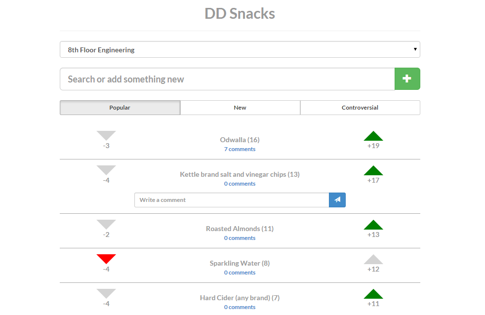

DDSnacks
========

Voting app for [DoubleDutch](http://doubledutch.me/) employees, primarily used to pick snacks for the snack rooms!

**Only accessible to DoubleDutch employees**

## Setup
Structure:
* REST backend based on the PHP framework [Laravel](http://laravel.com/)
* [AngularJS](https://angularjs.org/) single-page front-end

Requirements:
* Keys/secrets for hosting and Google login are not hosted in public repo
